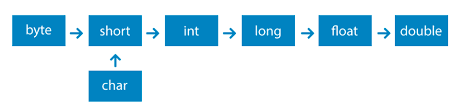

# Bootcamp Kotlin everis in Digital innovation

## Tipos de Dados

## Variaveis

- var (valor mutável, CamelCase)
- val (valor imutável, CamelCase)
- const val (valor imutável, SNAKE_CASE) -> declarada fora da função main.

## Operadores aritméticos

- Soma = a + b ou a.plus(b) ou a += b
- subtração = a - b ou a.minus(b) ou a -= b
- multiplicação = a _ b ou a.times(b) ou a _= b
- divisão = a / b ou a.div(b) ou a /= b
- resto = a % b ou a.mod(b) ou a %= b
